# OpenMOJ
Open Multimedia Over Java. Programa de dibujo y manejo de ficheros multimedia estilo *Paint* un poco más avanzado creado en JAVA.
Este repositoirio contiene el **programa principal** y una **librería de apoyo** para la gestión de la figuras.

###Características principales

####Gráficos

Se pueden dibujar hasta **9 figuras** en el lienzo. Las figuras disponibles son *trazo libre*, *segmento de linea*, *curva con un punto de control*, *curva con dos puntos de control*, *polilinea*, *rectángulo*, *rectángulo redondeado*, *elipse* y *arco*. Además pueden dibujarse texto con formato sencillo.

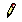**Trazo libre**

Esta figura se compone de segmentos de linea conexos entre puntos que se van trazanado mientras el ratón hace *dragged* sobre el Lienzo. La edición sólo permite mover la figura.

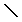**Linea**

Compuesta de dos puntos, posee dos puntos de control en los extremos de linea que permiten modificar su tamaño y posición. Esta figura puede moverse usando  cualquier otro punto que no sean puntos de control.

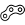**Curva con un punto de control**

Segmento de linea curvo con un punto de control. Modificables los extremos y el punto de control además puede moverse seleccionando la linea que forman los extremos (que no se muestran).

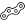**Curva con dos puntos de control**

Igual que la anterior pero con dos puntos de control.

**Polilinea**

Se compone de lineas entre puntos que se van añadiendo al hacer click en el lienzo formando una figura general. Cada uno de los puntos es un punto de control que puede modificarse en modo edición y seleccionando cualquier parte de la figura puede moverse.

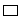**Rectángulo**

Figura que posee dos puntos de control en los extremos de su diagonal principal con los que puede modificarse. Puede moverse desde cualquier otro punto de su interior y es de las pocas a la que puede aplicársele **relleno**.

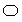**Rectángulo redondeado**

Igual que el rectángulo pero con los bordes redondeados.

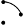**Arco**

Sección del perímetro de un círculo posee tres puntos de control con los que la figura puede moverse y además cambiar los ángulos, principio y fin, que definen el arco, así como su tamaño, definido por el radio.

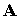**Texto**

Herramienta de creación de texto simple. Carga las fuentes del sistema y permite modificar el color, subrayar, tachar, hacer negrita y cursiva. La edición puede hacerse después de su escritura haciendo doble click sobre el texto para que la herramienta se vuelva a abrir.

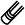 Cualquiera de las figura **puede eliminarse** haciendo doble click con el botón derecho del ratón, habiéndo seleccionado la herramienta borrar.

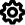  Se dispone de dos herramientas de edición para modificar el trazo de ls figuras y el relleno para aquellas que lo permitan. Además estas caracteristicas son propias de cada figura y de cada lienzo.

####Imagenes

El procesado de imágenes se realiza mediante módulos , herramientas externas que se abren en forma de ventana ofreciendo todos los ajustes posibles para la operación que se esté realizando a fin de no sobrecargar la GUI principal del programa.

######Lista de herramientas:

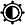 Brillo y contraste

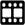 Negativo

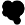 Emborronamiento

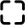 Detección frontera

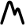 Relieve

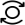 Rotar

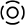 Enfoque

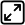 Escalar

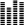 Umbralización

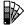 Escala de grises

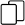 Duplicar

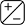 Operaciones binarias

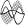 Función seno

####Audio

Posee un reproductor simple de ficheros de audio.

####Video

Posee un reproductor simple de ficheros de video y la posibilidad de realizar capturas de medios como la webcam.

##Capturas del programa

Ejemplos de uso:

1.Edición de texto y de figuras:

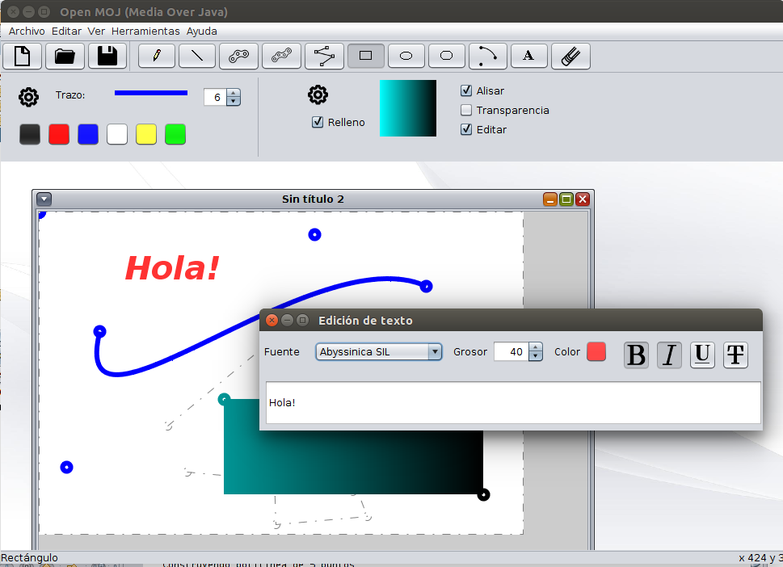

2.Uso de herramientas para imagen:

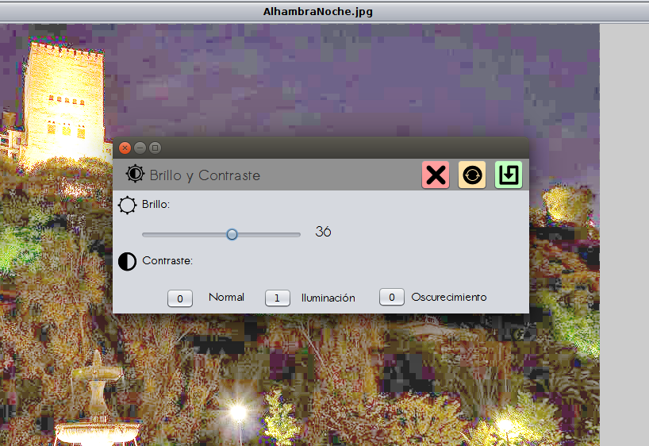

3.Herramientas para definición de trazado y relleno:

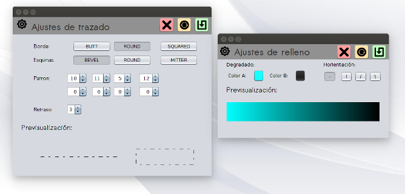

##Licencia y publicación

**Programa bajo licencia [GPLv3](http://www.gnu.org/licenses/gpl-3.0.en.html).**

**Se agradece toda colaboración y contribución.**

######Publicado en GitHub (+doc en linea):
https://github.com/juanAFernandez/sistemasMultimediaJava
